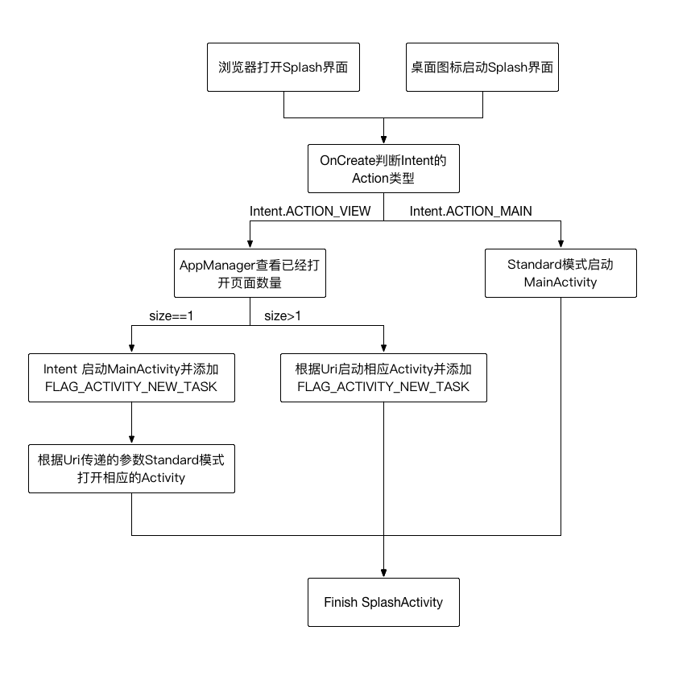

## 从浏览器打开本地应用

### 注意事项
- 通过设置 android:allowTaskReparenting=”true” 属性将处于浏览器任务栈中的页面，在本地应用启动时移动到自己的任务栈中，实现按 HOME 键启动本地应用能回到浏览器唤起的页面。
- 通过 Splash 页面做过渡，使用 Intent.FLAG_ACTIVITY_NEW_TASK 的方式启动浏览器唤起的页面，使得按返回键能接着显示本地应用中已打开的页面。
- 通过判断 Activity 的数量，决定是直接唤起页面，还是先唤起主界面再打开需要唤起的页面，使得按返回键不至于直接从二级或者三级界面退出本地应用，以提高用户体验。  

### 代码部分
```
//SplashActivity.java->onCreate
final Intent intent = getIntent();
if (intent != null) {
	if (Intent.ACTION_VIEW.equals(intent.getAction())) {
		handleAppOpenByOutside(intent);
	} else if (Intent.ACTION_MAIN.equals(intent.getAction())) {
		handleAppOpenByNormal();
	}
}

private void handleAppOpenByOutside(Intent outsideIntent) {
	int activitySize = MyApp.getInstance().getActivitySize();
	if (activitySize > 1) {
		Log.d(TAG, "浏览器->应用已打开");
		Activity lastActivity = MyApp.getInstance().getLastActivity();
		if (lastActivity != null) {
			Log.d(TAG, "lastActivity: " + lastActivity.getClass().getSimpleName());
			if (lastActivity instanceof ThirdActivity) {
				Log.d(TAG, "lastActivity是ThirdActivity");
				lastActivity.finish();
			}
		}
		jumpFromBrowser(outsideIntent.getData());
	} else { //注意: 跳转到主界面不要新建 Intent，直接沿用获得的 Intent 重新设置跳转信息即可
		Log.d(TAG, "浏览器->应用未打开");
		outsideIntent.setClass(mContext, MainActivity.class);
		outsideIntent.addFlags(Intent.FLAG_ACTIVITY_NEW_TASK);
		mContext.startActivity(outsideIntent);
	}
	finish();
}

private void handleAppOpenByNormal() {
	int activitySize = MyApp.getInstance().getActivitySize();
	if (activitySize > 1) {
		Log.d(TAG, "应用已打开");
	} else {
		Log.d(TAG, "应用未打开");
		mContext.startActivity(new Intent(mContext, MainActivity.class));
	}
	finish();
}

private void jumpFromBrowser(Uri uri) {
	ThirdActivity.actionStart(this, uri, true);
}

//MainActivity.java->onCreate
Intent intent = getIntent();
if (intent != null && Intent.ACTION_VIEW.equals(intent.getAction())) {
	ThirdActivity.actionStart(MainActivity.this, intent.getData(), false);
}

//ThirdActivity.java
public static void actionStart(Context context, Uri uri, boolean needNewTask) {
	Intent intent = new Intent(context, ThirdActivity.class);
	if (uri != null) {
		intent.setData(uri);
	}
	if (needNewTask) {
		intent.addFlags(Intent.FLAG_ACTIVITY_NEW_TASK);
	}
	context.startActivity(intent);
}
```
  
下面是设计流程图，按照这个设计流程，并且在 AndroidManifest.xml 中为主界面和浏览器需要唤起的页面设置 android:allowTaskReparenting=”true” 属性，你也可以实现知乎那样的浏览器唤起本地应用。  



### 鸣谢
- [如何优雅地从浏览器打开本地应用](http://blog.zhuimengfb.com/2017/04/30/%E5%A6%82%E4%BD%95%E4%BC%98%E9%9B%85%E5%9C%B0%E4%BB%8E%E6%B5%8F%E8%A7%88%E5%99%A8%E6%89%93%E5%BC%80%E6%9C%AC%E5%9C%B0%E5%BA%94%E7%94%A8/)
